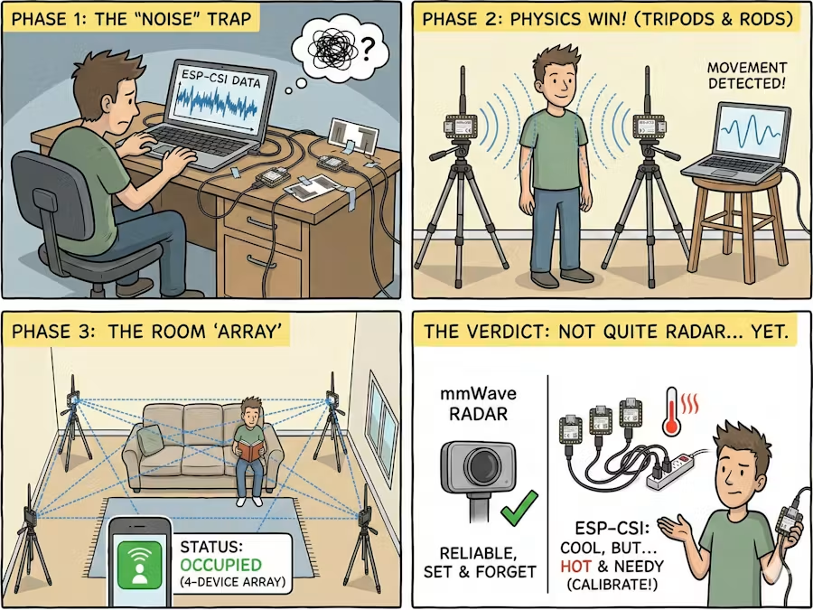

| Date started: August 13, 2026

# HideFromMySights

# Entry 01: August 13, 2026 - Brainstorming for the project
YEP! Another project for another ysws! Now it's a hardware project.

I mainly have the idea for it to be sort of a note taker that i can bring anywhere and then it would go into my workflows and keep it there. Since I'm a person who's trying to knowledge maxxing. Also I just think it's amazing that I can bring this school and make it record and put notes. Helpful for future exams that's for sure. While its quite literally better that I write those stuff myself, I do want to sort of share this with other people. I mean I know a friend who struggles with it that's for sure.

Something like the Plaud NotePin PRO?

Well, enough of that, let's get on with the list of components that I should probably get

MEMS Microphone
- This is for picking up the audio anytime when I want to take notes
ESP32 Module
- For the bluetooth functionality and accessing the software of choice to take down notes in
MicroSD card module
- For storing the storage of the audio files i want to transcribe
Power systems
- 

Yeah and I've also conducted some research on any existing technology like this.

One thing was the OMI wearable AI that summarizes literally anything that it can hear.

This is one device that could actually be   your very own JARVIS

There are several features that I can think of from the top of my head:
1. Make it store the knowledge somewhere else
2. Record conversations even from quite a distance
3. 

Hmm... but I also just had an amazing idea. What if I integrated social engineering into this? How? Well, it's honestly as simple as using the device in order 

Number of hours: 2 hours

# Entry 02: August 16, 2026 - How do we make the project cooler?

Okay I have no problems with this project at hand. Main question is, how do we somehow make it cooler?

It's more of, if my main goal is to do world domination, then what would be the best way to make this project work in that aspect?

Well, first of all, it's good to define what a spy device mainly does:

1. A listening device
2. Countersurvelliance devices
3. Tracking devices

Honestly no ideas are just coming in. Never had the desire to do something illegal I would say so. 

Even so, it would still be interesting to be able to have a project you can just use sort of a spying device.

Okay, so the initial idea was to create sort of a listening device that could take down conversation notes for you correct?
What if we had a camera on top of it (using the XIAO-ESP32-SENSE) so that the device could sort of combine with the laser
spying technique used back in the days?

By using an invisible rays, I'll be able to spy on long ranges without any suspicion. Just like the old-school CIA tech, huh?

Oh well, that is primarily my idea for tonight. I think it's worth doing. I mean, I have no other ideas other than that.

Total hours spent: 1 hour

# Entry 03: August 17, 2026 - Starting on the actual project

Okay, so I've sort of decided what to make. 

Three ideas:

1. A hardware that lets me see / hijack the public wifi and see the camera of the device they are on (most illegal)
2. A hardware that allows me to take note of every single conversation i am having (basically plaud note pin pro) and send it for summarization.
- I want to make this have more features but I'm not entirely sure how. I guess I'd have to figure it out.
3. A hardware where I can do wifi sensing to track people's movement and activity

There are some features that I need to make the audio recording device from other devices:
1. The battery life is long; you're not limited by a short amount of time
2. Not only would it be able to sort of the conversation, but maybe also another device that could also give me some real time 
feedback or thoughts to that.

Well, this is the more practical type of technology that I need.

A more interesting project would be using something like wifi sensing.

Okay I've settled on it. Let's do wifi sensing. I need to stop overthinking hahahaha.

Here's a cool AI diagram:

Some steps on how I would do this project:
1. Using a normal XIAO ESP32 to conduct the normal wifi sensing
2. Thinking about how to integrate this with an actual hardware
- Perhaps by also using an ESP32
3. If we have the wifi sensing, then what would be a good actuator? Maybe it can output to a software?
- Keep in mind there are a lot of things that I can actually do with this. Wifi sensing is just a glorified 
GPS type of trakcing.

Some devices, like dash cams, actually use this type of technology to make sensing precise.

I could make sort of a public wifi and supposedly spy on other people, "a wifi garden..."

For long range WIFI:
- Maybe LORA 
- So maybe I can search up LORA.

Interesting ideas honestly...

Expounding on the wifi sensing, let's take a look at some articles which may give insights on wifi sensing works

Using this article:
- https://www.hackster.io/limengdu0117/esp-csi-diy-wifi-human-presence-detection-f80508

The article sort of answered the question of the problem of modern spatial sensing,
the ESP32 could reliably do it while there are sensors built for it that cannot. Crazy, right?

All of this is by using CSI

What exactly is CSI?
1. Most are familiar with RSSI (received signal strength indicator) which measures the volume of the sound 
- Tells you how loud the signal is
2. CSI is different; if RSSI is  the "volume" then CSI is the "texture"
- Basically CSI captures the amplitude and phase information of each of these sub-carriers
- Changes how these waves reflect and scatter
- By analyzing the "shape" of these changes across the frequency spectrum, you can theoretically detect presence, movement, and even gestures

Some github links to take note of:
CSI sender:
- https://github.com/limengdu/XIAO_esp-csi/tree/master/examples/get-started/csi_send
CSI receiver:
- https://github.com/limengdu/XIAO_esp-csi/tree/master/examples/get-started/csi_recv

Okay, so by using wifi sensing, we can effectively sense what's near our surroundings. Now that we've got those sensing stuff sorted, it's important to also know what we will be using the wifi sensing on?

All I know is that if we wanted to make it long range, then we can use LORA

You know what, its no use thinking about it. I'll just do a sample with my XIAOs tomorrow.

TIme spent: 3 hours